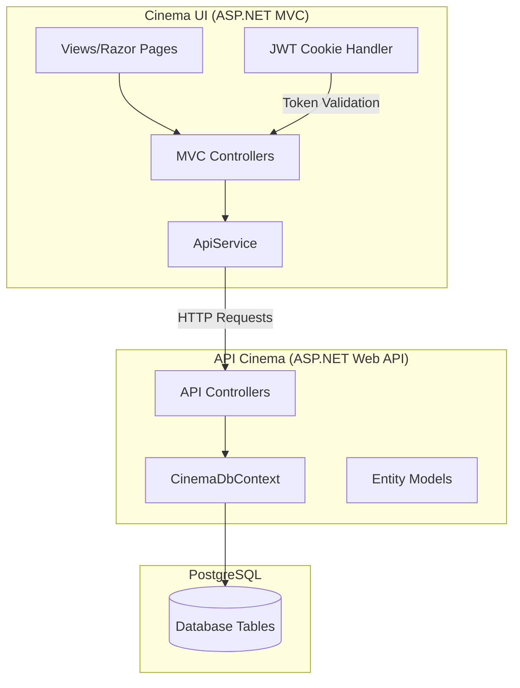
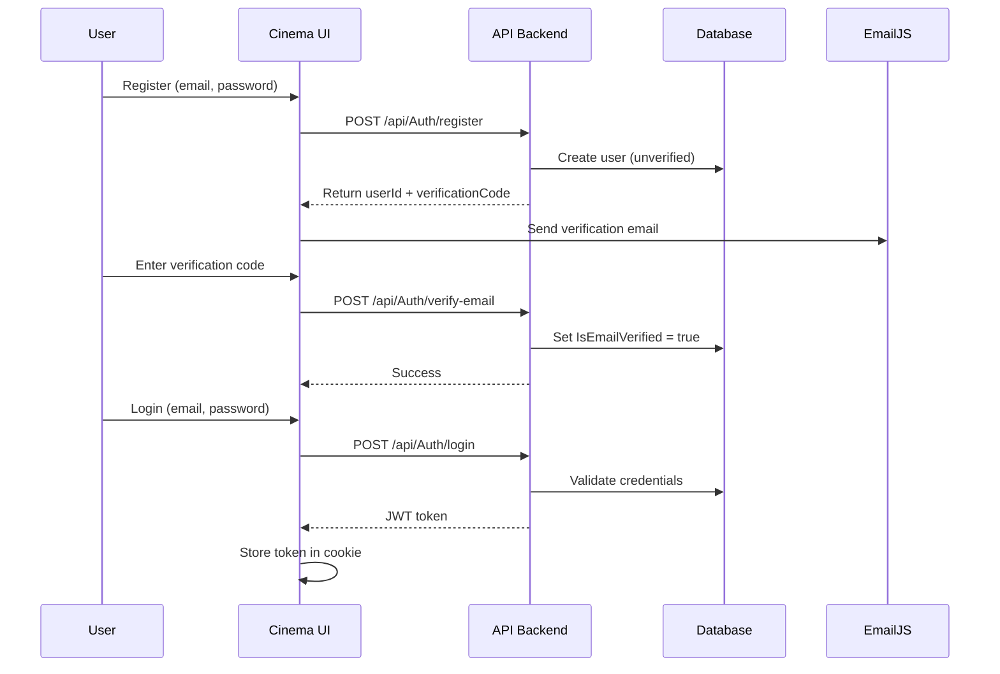
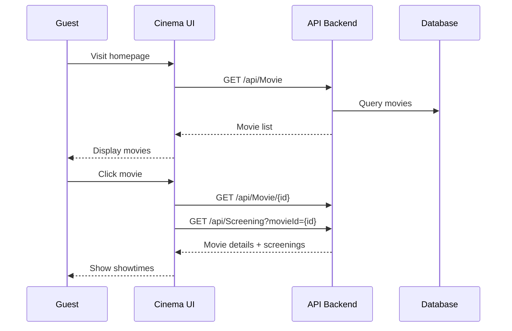
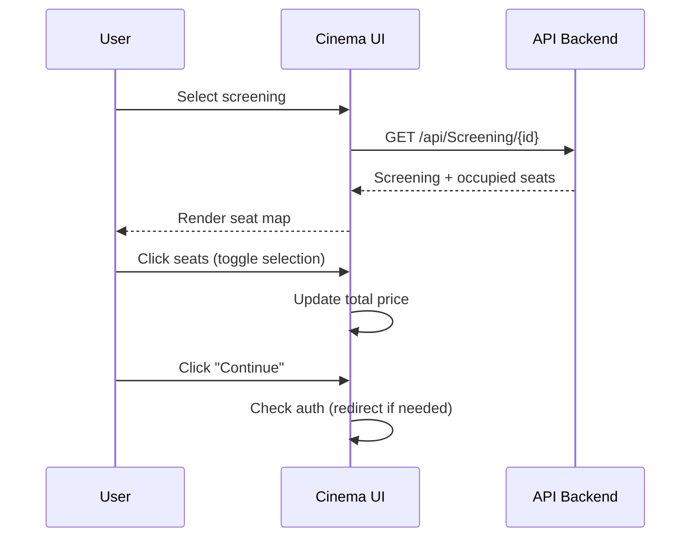
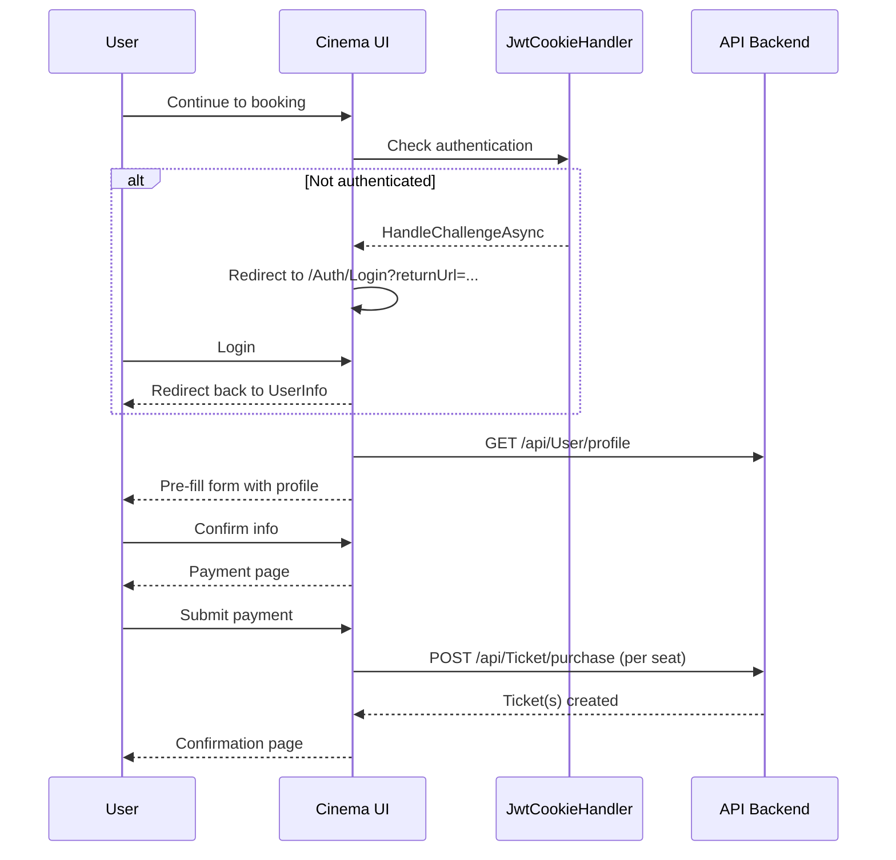
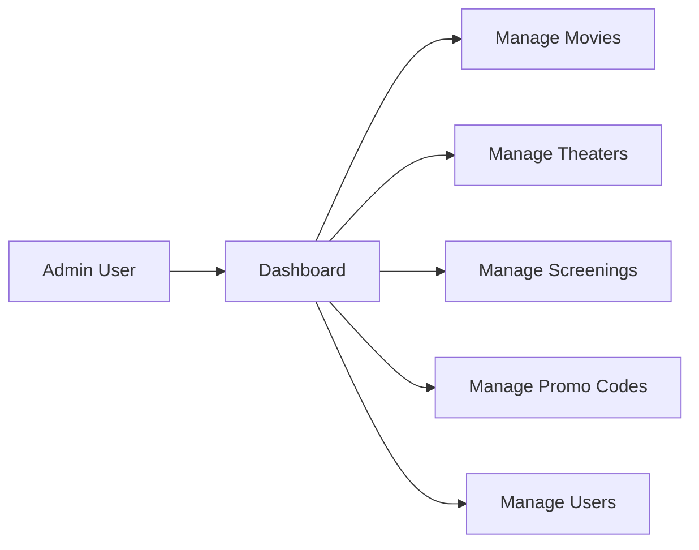

# Cinema Booking System - Technical Documentation

## System Architecture



---

## Project Structure

### Backend API (`api-cinema`)
```
api-cinema/
├── Controllers/           # API endpoints
│   ├── AuthController.cs      # Login, Register, Email Verification
│   ├── MovieController.cs     # Movie CRUD operations
│   ├── ScreeningController.cs # Screening management
│   ├── TicketController.cs    # Ticket purchase/management
│   ├── TheaterController.cs   # Theater CRUD
│   └── PromoCodeController.cs # Promo code validation
├── Models/                # Entity models
│   ├── User.cs               # User account
│   ├── Movie.cs              # Movie details
│   ├── Screening.cs          # Movie showtime
│   ├── Theater.cs            # Cinema location
│   ├── Room.cs               # Theater room
│   ├── Ticket.cs             # Purchased ticket
│   └── PromoCode.cs          # Discount codes
├── Data/
│   └── CinemaDbContext.cs    # EF Core database context
└── Migrations/               # Database migrations
```

### Frontend UI (`cinema-ui`)
```
cinema-ui/
├── Controllers/           # MVC controllers
│   ├── HomeController.cs     # Homepage
│   ├── AuthController.cs     # Auth views (Login/Register)
│   ├── TicketController.cs   # Booking flow
│   ├── ProfileController.cs  # User profile/tickets
│   └── AdminController.cs    # Admin dashboard
├── Services/
│   └── ApiService.cs         # HTTP client for backend API
├── Filters/
│   └── JwtCookieAuthenticationHandler.cs  # JWT auth
├── Views/                 # Razor views
│   ├── Home/                 # Homepage views
│   ├── Auth/                 # Login, Register, VerifyEmail
│   ├── Ticket/               # Booking flow views
│   ├── Profile/              # User profile views
│   └── Admin/                # Admin views
└── wwwroot/               # Static assets
    ├── css/                  # Stylesheets
    └── js/                   # JavaScript
```

---

## Core Processes

### 1. User Authentication Flow



**Key Files:**
- [AuthController.cs (API)](file:///home/exxo/code/cinema-api/api-cinema/Controllers/AuthController.cs) - Backend auth endpoints
- [AuthController.cs (UI)](file:///home/exxo/code/cinema-api/cinema-ui/Controllers/AuthController.cs) - Frontend auth views
- [JwtCookieAuthenticationHandler.cs](file:///home/exxo/code/cinema-api/cinema-ui/Filters/JwtCookieAuthenticationHandler.cs) - JWT validation

**Code Flow:**
1. User submits registration form → `AuthController.Register()` POST action
2. `ApiService.RegisterAsync()` calls backend `/api/Auth/register`
3. Backend generates 6-digit verification code, saves to database
4. Frontend uses EmailJS to send verification email (client-side)
5. User enters code → `AuthController.VerifyEmail()` validates via API
6. Login sets JWT token in HttpOnly cookie

---

### 2. Movie Browsing (Guest Allowed)



**Key Files:**
- [HomeController.cs](file:///home/exxo/code/cinema-api/cinema-ui/Controllers/HomeController.cs) - Homepage
- [TicketController.cs](file:///home/exxo/code/cinema-api/cinema-ui/Controllers/TicketController.cs) - `MovieDetail()` action (AllowAnonymous)
- [MovieController.cs (API)](file:///home/exxo/code/cinema-api/api-cinema/Controllers/MovieController.cs) - Movie endpoints

**Guest Access:**
The `[AllowAnonymous]` attribute on `MovieDetail` and `SelectSeats` allows unauthenticated users to:
- Browse all movies
- View movie details and showtimes
- Select seats

---

### 3. Seat Selection (Multi-Seat Support)



**Key Files:**
- [SelectSeats.cshtml](file:///home/exxo/code/cinema-api/cinema-ui/Views/Ticket/SelectSeats.cshtml) - Seat selection UI
- JavaScript handles multi-seat toggle and price calculation

**Multi-Seat Implementation:**
```javascript
// Toggle seat selection
if (this.classList.contains('seat-selected')) {
    this.classList.remove('seat-selected');
    selectedSeats = selectedSeats.filter(s => s !== seatNumber);
} else {
    this.classList.add('seat-selected');
    selectedSeats.push(seatNumber);
}
// Calculate total: selectedSeats.length * pricePerSeat
```

---

### 4. Checkout Flow (Authentication Required)



**Key Files:**
- [TicketController.cs](file:///home/exxo/code/cinema-api/cinema-ui/Controllers/TicketController.cs) - `UserInfo`, `Payment`, `ProcessPayment`
- [UserInfo.cshtml](file:///home/exxo/code/cinema-api/cinema-ui/Views/Ticket/UserInfo.cshtml)
- [Payment.cshtml](file:///home/exxo/code/cinema-api/cinema-ui/Views/Ticket/Payment.cshtml)

**Multi-Ticket Purchase:**
```csharp
// ProcessPayment action purchases one ticket per seat
foreach (var seatNumber in seatNumbers)
{
    var ticket = await _apiService.PurchaseTicketAsync(screeningId, seatNumber);
    purchasedTicketIds.Add(ticket.Id);
}
```

---

### 5. Admin Dashboard



**Key Files:**
- [AdminController.cs](file:///home/exxo/code/cinema-api/cinema-ui/Controllers/AdminController.cs) - All admin actions
- `/Views/Admin/` - Admin views for each section

**Access Control:**
```csharp
[Authorize(Roles = "Admin")]
public class AdminController : Controller
```

---

## Data Models

### User
| Field | Type | Description |
|-------|------|-------------|
| Id | int | Primary key |
| Email | string | Unique email |
| PasswordHash | byte[] | Hashed password |
| PasswordSalt | byte[] | Password salt |
| Role | string | "User" or "Admin" |
| IsEmailVerified | bool | Email verification status |
| EmailVerificationCode | string? | 6-digit code |

### Movie
| Field | Type | Description |
|-------|------|-------------|
| Id | int | Primary key |
| Title | string | Movie title |
| Description | string | Synopsis |
| Genre | string | Genre |
| DurationMinutes | int | Runtime |
| PosterUrl | string | Poster image URL |
| IsFeatured | bool | Featured on homepage |

### Screening
| Field | Type | Description |
|-------|------|-------------|
| Id | int | Primary key |
| MovieId | int | FK to Movie |
| TheaterId | int | FK to Theater |
| RoomId | int | FK to Room |
| ShowTime | DateTime | Screening time |
| Price | decimal | Ticket price |

### Ticket
| Field | Type | Description |
|-------|------|-------------|
| Id | int | Primary key |
| ScreeningId | int | FK to Screening |
| UserId | int | FK to User |
| SeatNumber | string | e.g., "A1", "B5" |
| Price | decimal | Paid amount |
| Status | string | "Active", "Cancelled" |

---

## API Endpoints

### Authentication
| Method | Endpoint | Description |
|--------|----------|-------------|
| POST | `/api/Auth/register` | Register new user |
| POST | `/api/Auth/login` | Login and get JWT |
| POST | `/api/Auth/verify-email` | Verify email with code |
| POST | `/api/Auth/resend-verification` | Resend verification code |

### Movies
| Method | Endpoint | Description |
|--------|----------|-------------|
| GET | `/api/Movie` | List all movies |
| GET | `/api/Movie/{id}` | Get movie by ID |
| GET | `/api/Movie/featured` | Get featured movie |
| POST | `/api/Movie` | Create movie (Admin) |
| PUT | `/api/Movie/{id}` | Update movie (Admin) |
| DELETE | `/api/Movie/{id}` | Delete movie (Admin) |

### Screenings
| Method | Endpoint | Description |
|--------|----------|-------------|
| GET | `/api/Screening` | List screenings |
| GET | `/api/Screening/{id}` | Get screening with seat info |
| GET | `/api/Screening?movieId={id}` | Screenings for movie |
| POST | `/api/Screening` | Create screening (Admin) |

### Tickets
| Method | Endpoint | Description |
|--------|----------|-------------|
| GET | `/api/Ticket/my` | User's tickets |
| POST | `/api/Ticket/purchase` | Purchase ticket |
| POST | `/api/Ticket/{id}/cancel` | Cancel ticket |

### Promo Codes
| Method | Endpoint | Description |
|--------|----------|-------------|
| POST | `/api/PromoCode/validate` | Validate promo code |

---

## Security

### JWT Authentication
- Tokens stored in HttpOnly cookies (XSS protection)
- Token includes: userId, username, role
- Expiry: 24 hours

### Password Security
- Passwords hashed with salt using HMAC-SHA512
- Salt stored alongside hash

### Authorization
- `[Authorize]` - Requires authentication
- `[Authorize(Roles = "Admin")]` - Admin only
- `[AllowAnonymous]` - Public access

---

## External Services

### EmailJS Integration
Used for sending emails without a backend email server:
- **Service ID:** `service_qz6sbsp`
- **Template ID:** `template_9r07mb9` (verification emails)
- **Public Key:** `3JJbf4JB2-x-unn4F`

Emails are sent from the client browser using the EmailJS SDK.
